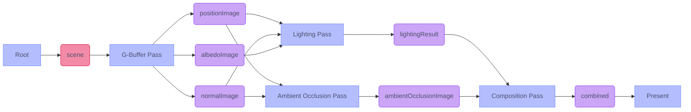

# RenderGraph

Prototype for a RenderGraph system and compiler with support for:
- Pass and resource culling.
- Task execution order generation.
- Async task scheduling.
- Memory optimization via aliasing.
- Automatic barrier and synchronization generation.

### Example RenderGraph

### Compiler Output : Timeline
- Main rendering queue
- Async compute queue
- Resource allocations (labels represent usage for a range)

```mermaid
---
displayMode: compact
---
gantt
	dateFormat X
	axisFormat %s
	section Passes
		Root : 0, 1
		G-Buffer Pass : 1, 2
		Lighting Pass : 2, 3
		Composition Pass : 3, 4
		Present Pass : 4, 5
	section Async
		Ambient Occlusion Pass :crit, 2, 3
	section Resource #0
		combined : 3, 5
		positionImage : 1, 3
	section Resource #1
		normalImage : 1, 3
	section Resource #2
		albedoImage : 1, 3
	section Resource #3
		motionVectors : 1, 4
	section Resource #4
		ambientOcclusionImage : 2, 4
```
